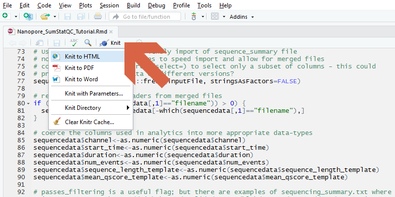

******************

# 1. Introduction:


### Overview:

The aim of this **transcriptome** tutorial is to demonstrate a workflow for long-read differential isoform analysis based on cDNA sequence data. This workflow is suitable for fastq sequence collections with a paired design (e.g. tumour/normal) where a reference transcriptome sequence is available. 

### Features:

The tutorial is provided with example data and the tutorial workflow is used to address experimental questions that include 

* What are the read characteristics for my starting sequence collection?
* which genes are expressed in my study?
* which genes are upregulated in this tumour sample?
* which gene isoforms show differential expression?
* show gene expression levels for gene *ENSG00000142937*
* show transcript expression levels for transcript *ENST00000464658*

******************

# 2. Getting Started:

This tutorial relies on **`conda`** for the installion of software that includes **`R`**, **`Rstudio`**, **`minimap2`**, **`samtools`**, **`salmon`**, **`edgeR`**, **`DEXSeq`** and **`DRIMSeq`**. It is necessary to have **`git-lfs`** installed on your system to download the accompanying long-read sequence and metadata files that are stored using Git Large File Storage.

### Input and Output: 

This tutorial uses the code contained within the Github repository and an experimental design file (config.yaml) that processes the provided cDNA sequence files (in fastq format) with the [pipeline-transcriptome-de](https://github.com/nanoporetech/pipeline-transcriptome-de) analytical workflow. 

### Dependencies:

This tutorial requires a computer running Linux (Centos7, Ubuntu 18_10, Fedora 29). The tutorial has been tested on minimal server installs of these operating systems.

Other dependencies include

* **`bash`** shell  for interacting with the computer

### Installation:

1. Most of the software dependencies are managed though **`conda`**. Install as described at  <br> [https://conda.io/docs/install/quick.html](https://conda.io/docs/install/quick.html). You will need to accept the license agreement during installation and we recommended that you allow the conda installer to prepend its path to your `.bashrc` file when asked.
```
    wget https://repo.anaconda.com/miniconda/Miniconda3-latest-Linux-x86_64.sh
    bash Miniconda3-latest-Linux-x86_64.sh
    bash
```
2. Download the tutorial & accompanying example files into a folder named `transcriptome_tutorial`. This tutorial requires the **`git-lfs`** large file support capabilities, which should be installed through **`conda`** first
```
    conda install -c conda-forge git-lfs
    git lfs install
    git clone https://github.com/nanoporetech/ont_tutorial_transcriptome.git transcriptome_tutorial
```
3. Change your working directory into the new `transcriptome_tutorial` folder 
```
    cd transcriptome_tutorial
```
4. Install software dependencies using conda
```
    conda env create --name transcriptome_tutorial --file environment.yaml
```
5. Initialise the conda environment 
```
    source activate transcriptome_tutorial
```


#### Compilation From Source

This tutorial should not require the compilation of any software. The **`conda`** software management system should manage all required bioinformatics software dependencies.


### Usage: 

In your Conda environment, and in the tutorial working directory,

1. *optional* edit the provided **`config.yaml`** file to match your own study design
2. Run the Snakefile workflow (the command assumes 4 available threads; adjust to match your computer's capabilities)
```
    snakemake -j 4
```
3. Render the report using results from the analysis above
```
    R --slave -e 'rmarkdown::render("Nanopore_Transcriptome_Tutorial.Rmd", "html_document")'
```

The provided Rmarkdown tutorial script can also be opened directly in Rstudio

```
rstudio Nanopore_Transcriptome_Tutorial.Rmd
```

The report can be prepared by "knit" from the GUI as shown in the figure




******************

# 3. Results

This tutorial workflow will produce a rich description of your sequence library characteristics and will summarise the key results from the DGE and DTU analyses. Please visit the tutorial page at [https://community.nanoporetech.com/knowledge/bioinformatics]( https://community.nanoporetech.com/knowledge/bioinformatics) for more information

******************

# 4. Help:

### Licence and Copyright:

© 2019 Oxford Nanopore Technologies Ltd.

**`ont_tutorial_pinfish`** and other Nanopore tutorials are distributed by Oxford Nanopore Technologies under the terms of the MPL-2.0 license.

### FAQs:


### Abbreviations:

* __DGE__ is an abbreviation for *Differential Gene Expression* 

* __DTU__ is an abbreviation for *Differential Transcript Usage*

* __knit__ is the command to render an Rmarkdown file. The knitr package is used to embed code, the results of R analyses and their figures within the typeset text from the document. 

* __L50__  the number of sequences (or contigs etc) that are longer than, or equal to, the N50 length and therefore include half the bases of the assembly

* __N50__  length such that sequences (or contigs etc) of this length or longer include half the bases of the sequence collection

* __Rmarkdown__ is an extension to markdown. Functional R code can be embedded in a plain-text document and subsequently rendered to other formats including the PDF format of this report.

* __QV__  the quality value -log10(p) that any given base is incorrect. QV may be either at the individual base level, or may be averaged across whole sequences


### References and Supporting Information:

*  https://community.nanoporetech.com/knowledge/bioinformatics
*  https://www.r-project.org/
*  https://snakemake.readthedocs.io/en/stable/
*  https://bioconda.github.io/
*  https://github.com/nanoporetech/pipeline-transcriptome-de
